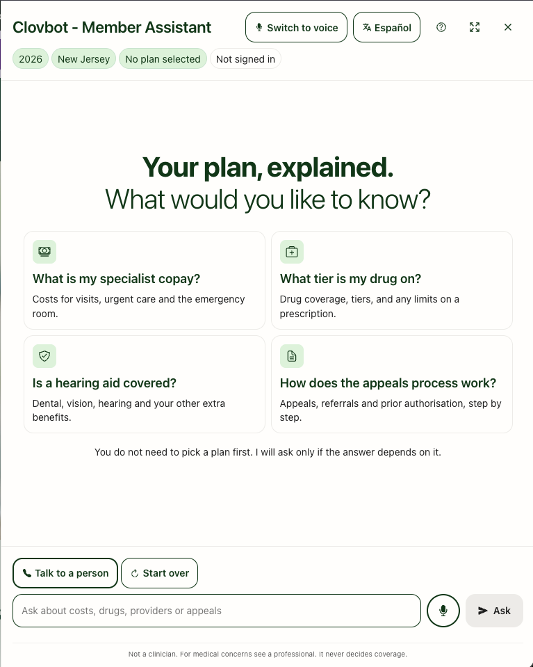
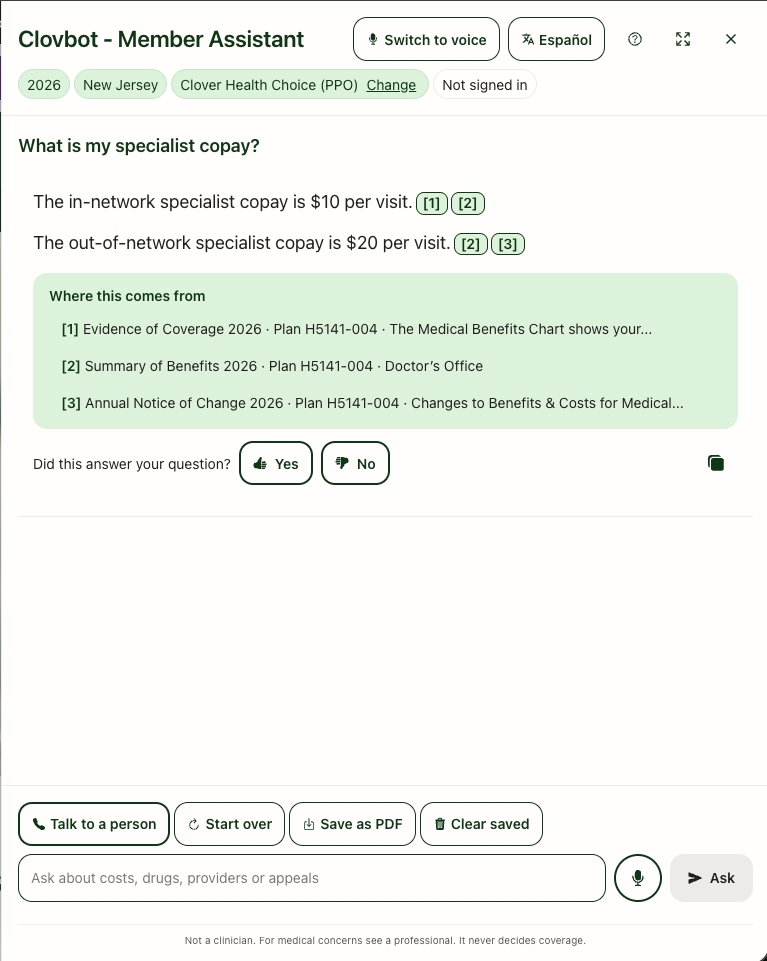
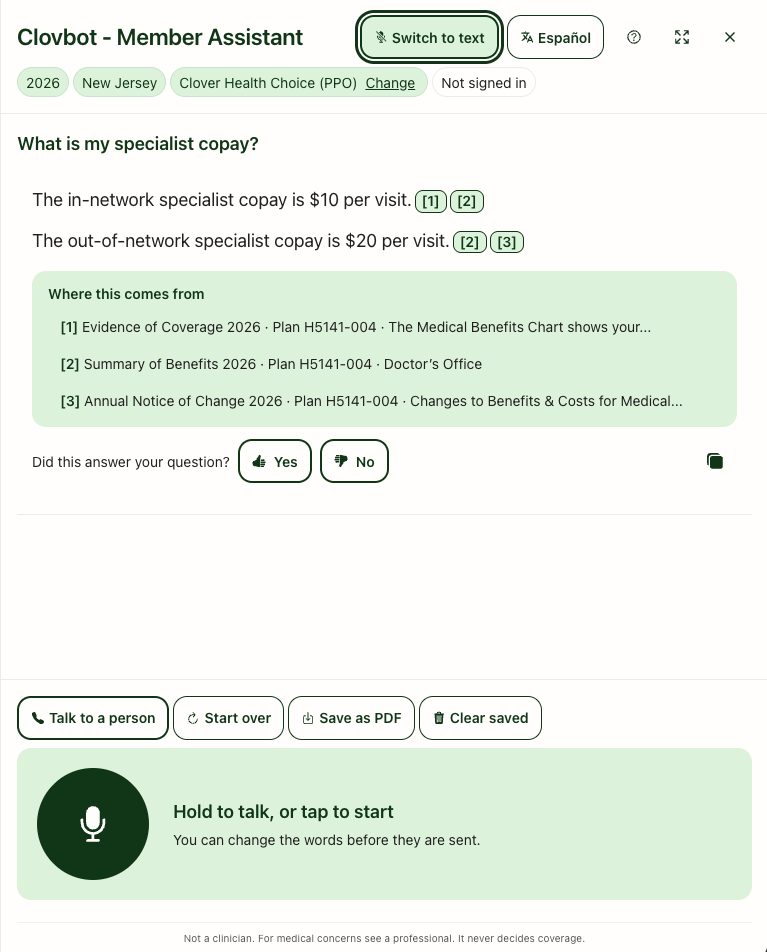
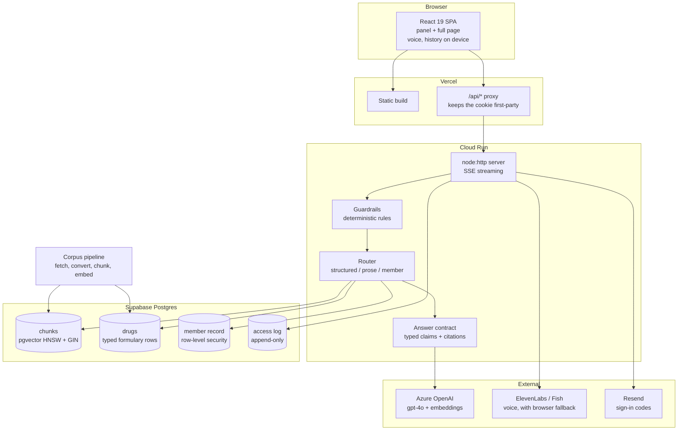
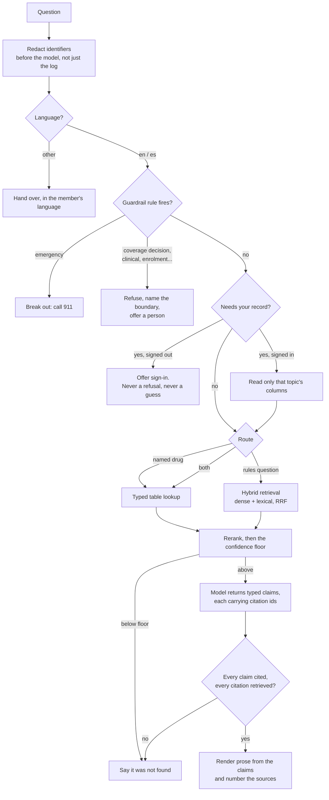
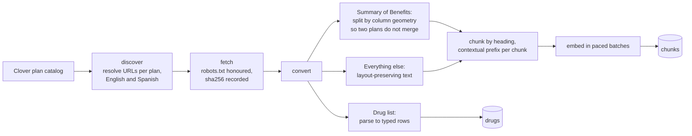

<p align="center">
  
</p>

<h1 align="center">Clovbot</h1>

<p align="center">
  <strong>A Medicare Advantage assistant that cites every fact, or refuses.</strong><br>
  Ask about your plan in English or Spanish. Every answer names the document, plan and section it came from. Sign in and it answers from your own record, and tells you which fields it read.
</p>

<p align="center">
  
  
  
  
  
  
  
  
  
  
</p>

<p align="center">
  
  
  
</p>

<p align="center">
  <em>Screenshots are placeholders. Drop the real captures at
  <code>docs/assets/landing.png</code>, <code>docs/assets/answer.png</code> and
  <code>docs/assets/voice.png</code>.</em>
</p>

---

Clovbot answers Medicare Advantage plan questions from **real 2026 Clover Health documents**: the Evidence of Coverage, Summary of Benefits, Annual Notice of Change, the drug list and Clover's public pages, for three plans across two contracts. Every factual sentence carries a citation to the document, plan and section behind it. A question the documents cannot answer is refused with the phone number, never guessed. Sign in with an emailed code and it also answers from a **synthetic** member record: what a claim cost, where a prior authorisation stands, how much of an allowance is left.

**No real member data enters this system at any version.** Every record is invented and labelled synthetic in the schema, in the seed and in the output.

Built with [_throughspec_](https://throughspec.v-ai.org/), a Spec-Driven Development kit.

---

## Who this is for, and why it looks like this

The audience is Clover Health members, **mostly 65 and over**. Nearly every visible decision follows from that rather than from taste, and the research behind it is in [docs/research-init.md](./docs/research-init.md).

| The choice | Why, for this audience |
| --- | --- |
| **A citation under every sentence** | The University of Michigan's 2025 healthy-aging poll found 46% of adults over 50 have little or no trust in AI. Trust is not won by sounding confident; it is won by showing the document. |
| **"Talk to a person" on screen at all times**, including mid-answer | The fastest path to a human is never more than one tap away, so a member who gives up on the bot does not give up on the plan. |
| **Refuse rather than guess** | A wrong copay is worse than no copay. The member acts on it, and finds out at the pharmacy counter. |
| **Voice, with press-and-hold *and* tap-to-start** | A hold sustained for the length of a spoken question is hard with tremor or arthritis, and a slipped finger loses the whole question. Both gestures always work, and neither is a setting to find. |
| **18px text floor, 44x44px targets** | WCAG 2.2 asks for 24x24; this uses the AAA 44x44 instead. Nielsen Norman's senior guidelines are explicit about small, clustered targets being the common failure. |
| **Pasteable sign-in codes** | WCAG 2.2 criterion 3.3.8. A code you must retype from memory is a cognitive test, and it is the single highest-friction surface in the product. |
| **Spanish end to end**, from Spanish source documents | Clover publishes its plan documents in Spanish. Answering a Spanish question from an English document, or by translating an English answer, would produce a claim no source supports. |
| **Answers say when the plan year has passed** | Audio cannot be scrolled back to, so the staleness notice is read aloud with the answer as well as shown. |

---

## What it does

- **Ask in plain language** and get an answer built claim by claim, each with a numbered citation to its source. A sentence the documents do not support is not shown at all.
- **Ask in Spanish** and get a Spanish answer from Spanish source documents, with Spanish citations.
- **Compare plans without knowing you are.** The same question returns $6,000 under the HMO and $9,250 under the PPO, each cited to that plan's own document.
- **Look up a drug** and get its tier, therapeutic class and any prior-authorisation or quantity limit, read from a typed table rather than searched for in prose.
- **Sign in without a password.** A six-digit code by email, entered inside the conversation, so the conversation survives.
- **Ask about your own record** once signed in, cited to the exact field it read.
- **Talk instead of typing**, and hear the answer read back while the written version stays on screen.
- **Get handed to a person** when the assistant cannot help, with your question, your plan and the documents already searched carried across.

---

## Quickstart

```bash
git clone https://github.com/vishalpatil18/clovbot.git
cd clovbot
npm install
cp .env.example .env        # every value is commented in the file
```

You need a Postgres database with `pgvector` (a free Supabase project is easiest) and an Azure OpenAI resource (`gpt-4o` plus `text-embedding-3-small`). Voice, email sign-in and the reranker are optional and degrade rather than fail.

Apply the migrations in `migrations/` in numeric order, then build the corpus and index it:

```bash
npm run corpus:discover     # resolve the document URLs from Clover's catalog
npm run corpus:fetch        # download the PDFs and public pages
npm run corpus:convert      # PDF to text, and the two-column benefit tables by geometry
npm run ingest              # chunk, embed, and write the typed drug rows
npm run seed:members        # five synthetic members
```

Then, in two terminals:

```bash
npm run api                 # 1. API on http://localhost:5174
npm run web                 # 2. Vite dev server on http://localhost:5173
```

Ask a question at the terminal without a browser:

```bash
npm run ask -- "what is the specialist copay" --plan 004
```

Full setup, secrets and the deploy runbook: **[docs/deployment.md](./docs/deployment.md)**.

---

## Architecture

Three deployable pieces and one database.

1. **Web** - a Vite + React 19 single-page app on Vercel, which also proxies `/api/*` so the session cookie stays first-party.
2. **API** - a Node HTTP server on Cloud Run. No framework: `node:http`, server-sent events for streaming, and hand-rolled routing.
3. **Corpus pipeline** - command-line only, run before deploy. It fetches, converts and indexes the plan documents; the running service never touches a PDF.

### System architecture



### How one question becomes an answer

Every gate before the model is a **rule**, not a classifier. A zero-tolerance boundary cannot rest on something probabilistic, and every refusal has to be explainable by pointing at the rule that fired.



The load-bearing idea is the last two steps. **The model never writes the prose.** It returns typed claims, each carrying the ids of the chunks that support it; the application validates that every claim is cited and every citation was actually retrieved, then renders the sentences itself. An uncited claim is not a claim that gets flagged, it is a payload that fails validation and never reaches the screen.

### How the corpus is built



The Summary of Benefits is one PDF describing **two plans in two columns**. Reading it as text merges them, and a member gets the other plan's copay. It is parsed from word coordinates instead, and a page whose columns cannot be attributed to a plan **fails the build** rather than emitting an amount that might belong to either.

Long-form: **[docs/architecture.md](./docs/architecture.md)**.

---

## Tech stack

| Layer | Choice | Why this and not the obvious alternative |
| --- | --- | --- |
| Runtime | **Node 26**, native TypeScript type-stripping | No build step for the server. `node --experimental-strip-types` runs the source. |
| Language | **TypeScript 7**, strict, no `any` | Unions over loose strings; Zod at every trust boundary. |
| API | **`node:http`**, no framework | The whole surface is a dozen routes and one SSE stream. Express would be a dependency for routing that fits on a page. |
| Database | **Postgres + pgvector** (Supabase) | Vectors, lexical search, typed rows and row-level security in one place. A separate vector store would mean two systems to keep consistent. |
| Retrieval | **Hybrid dense + lexical, fused by RRF inside one SQL function** | Scoped to the plan *before* ranking. Ranking first and filtering after lets the wrong plan's copay win on similarity. |
| Reranking | **Local ONNX cross-encoder** via `@huggingface/transformers` | Runs on the box. No per-query cost, no third vendor. |
| Generation | **Azure OpenAI** `gpt-4o`, temperature 0 | A BAA-eligible tier, which is hygiene even with zero real data. |
| Frontend | **React 19 + Vite 8**, hand-written CSS | The design system is 40 tokens. Tailwind would add a build dependency to ship them. |
| Animation | **Framer Motion 13** | The only runtime UI dependency added, and it respects `prefers-reduced-motion`. |
| Voice | **ElevenLabs, Fish Audio, then the browser synthesiser** | The last tier cannot run out of credits, which is the point of having it. |
| Email | **Resend** free tier | Sign-in codes only. |
| Caching | **Postgres, exact-keyed** | Answers, query embeddings and synthesised audio in the store the app already has. Rejected: semantic caching on similarity, which can return a confidently wrong amount; and in-process or on-disk caches, which die with a Cloud Run instance. |
| Tests | **Vitest 5** | 756 tests, no DOM library, offline, about a second. |

---

## Features

**Answering**
- Cited answers built from typed claims, with cite-or-refuse enforced by validation rather than by prompt
- Hybrid retrieval over 26 documents, three plans, two contracts, scoped by plan and language before ranking
- Typed drug-list lookup with tier, class and utilisation-management flags
- Combined answers: a drug question and a rules question in one sentence get both halves, each with its own source
- Long answers grouped under the part of the document each set of sentences came from
- Staleness notice once the calendar passes the plan year, spoken as well as written

**Authenticated tier** (synthetic records only)
- Passwordless sign-in with an emailed six-digit code, inside the conversation
- Member-record answers cited to the record and the exact field
- Questions the plan documents can answer are never put behind a sign-in
- Signing out removes record-sourced answers from the conversation saved on the device

**Voice**
- Press-and-hold or tap-to-start, both always available
- The transcript is shown and editable before it is sent
- Answers read aloud while the written version stays on screen
- Spanish answers read in a Spanish voice

**Interface**
- Panel and full-page layouts, keyboard reachable, `prefers-reduced-motion` honoured
- Language control beside the voice control, in both layouts
- Conversation saved on the device and restored, with an explicit clear
- Print to a clean copy with every source intact; copy one answer with its sources
- Help panel, plan switcher, suggested questions

**Performance**
- Repeated questions answered from cache with no model call, keyed exactly so a near-identical question never inherits the wrong answer
- Re-indexing the corpus clears the answers cached against it, so a document change can never be answered from before it
- Query embeddings cached on the text and the model
- Spoken answers synthesised once and served from the database, so a recording survives a restart and is shared between instances

**Operations**
- One eval run reports four gates
- Turn log with route, reason, latency and outcome; answer reproduction from a turn id
- Row-level security and an append-only access log over the member record

---

## Key design decisions

Ninety-four decisions are recorded in [claude/design-decisions.md](./claude/design-decisions.md). These are the ones that shaped everything after them.

| Decision | What it changed |
| --- | --- |
| **The model returns claims, not prose** | Cite-or-refuse became a property of the type system instead of an instruction the model might ignore. Every later feature, including member records and Spanish, travels the same validation path for free. |
| **Zero real PHI, at every version** | Not a v1 limitation but a permanent boundary. It is what makes an authenticated tier defensible in a case study, and it is why [docs/real-phi.md](./docs/real-phi.md) exists to say what would change if the data were real. |
| **Deterministic rules wherever the gate is zero-tolerance** | Guardrails, the router and login detection are regex rules, not classifiers. Slower to write, and every decision can be explained by pointing at the rule that fired. |
| **Plan scoping in SQL, before ranking** | Two plans share near-identical prose with different amounts. This is the difference between a correct answer and a confidently wrong one. |
| **The Summary of Benefits is parsed by geometry** | Two plans in two columns. A page that cannot be attributed fails the build rather than guessing, which is what caught a lowercase Spanish header that would otherwise have merged the columns silently. |
| **Retrieval paths are additive** | A question that is both a drug lookup and a rules question keeps both halves. Neither can be dropped by a router that picked one. |
| **The same rule gates a question and scopes the read** | Whether you must sign in and what gets read from your record are one call, so they cannot disagree. |
| **The Spanish instruction rides on the user message** | Measurement showed that touching the system prompt moves faithfulness and flips cases, so the English prompt stays byte-identical and Spanish costs English nothing. |
| **The answer cache is keyed on the question, not its meaning** | "What is my specialist copay" and "what is my out-of-network specialist copay" are one word and ten dollars apart. Semantic caching is the documented design in `docs/ideas.md`, and its own warning is why this one keys on the exact question inside its plan, language and corpus scope. A signed-in member's turn is never cached at all. |
| **A regression gate one case below the measured baseline** | Set from a measurement, with the measurement written beside it, rather than a round number that would drift upward every time it failed. |

---

## Guardrails and evaluation

### Guardrails

Ten refusal categories, as rules. Emergencies are checked first, because a member describing acute symptoms needs care guidance before any other boundary applies. Each rule carries an `unless` for the answerable question that looks like it: *"how do I file an appeal"* is a process question the documents answer, while *"was my denial correct"* is a coverage determination and is refused.

The regulatory line is CMS-4201-F and the February 2024 CMS FAQ: the assistant **informs, it does not adjudicate**. It answers in English and Spanish; any other language gets a plain handover rather than a half-translated guess. Rules fire in both languages, which the golden set proved was not automatic: translating the explanations left the English-only patterns unable to match a Spanish emergency at all.

### Evaluation

One command, four reports, all gating:

```bash
npm run eval
```

| Report | What it measures | Last run |
| --- | --- | --- |
| Answers | Faithfulness judged against the retrieved chunks, structural compliance, refusal rate, per bucket and per language | 0.963 faithfulness, 100% structural, 10.0% refusal |
| Router | Whether each question took the right retrieval path | 32/32, zero drug questions degraded to prose |
| Login detection | Both directions, reported separately and never pooled | 34 cases, zero false negatives, zero false positives |
| Regression gate | Every P1 metric against its measured floor | all floors met |

The golden set is 66 hand-labelled cases: answerable, member-specific, guarded, adversarial and Spanish. Faithfulness is reported **per language**, because six Spanish cases against sixty English ones could score zero and barely move a pooled average.

Two gating rules worth knowing. **Login false negatives are zero-tolerance** - one member-specific question answered without a session fails the build, while the harmless direction is gated at 95% and reported separately, because a single accuracy number would let the severe error hide behind the mild one. And **misrouting a drug question to prose search is zero-tolerance** for the same reason.

Row-level security and the access log have their own proofs, both run against a real database with the application bypassed:

```bash
npm run check:rls       # no member's rows reachable from another's session
npm run check:audit     # every authenticated read recorded, and unalterable
```

More: **[docs/testing-strategy.md](./docs/testing-strategy.md)**.

---

## Development workflow

Every feature moves through six phases, and skipping one needs a logged override. The contract Claude Code works under is [CLAUDE.md](./CLAUDE.md); read it before changing anything.

1. Requirements → 2. Architecting → 3. Product Specs → 4. Tech Specs → 5. Planning → 6. Code

| Skill | Purpose |
| --- | --- |
| `/spec-requirements` | Build or amend the SRS |
| `/spec-design` | Build or amend the design system |
| `/spec-plan` | Build the staged plan |
| `/spec-feature` | Run a full feature cycle |
| `/spec-bug` | Reproduce, regression-test, fix |
| `/spec-docs` | Diff docs against reality and apply |

Four rules are non-negotiable and bind subagents too: **spec before code**, **test before implementation**, **zero real PHI ever**, and **cite or refuse**.

The memory layer is updated in a fixed order after every cycle: `claude/context.md`, `claude/features.md`, `claude/design-decisions.md`, `claude/learnings.md`, `CHANGELOG.md`.

```bash
npm test          # 756 tests, offline, about a second
npm run typecheck # both projects
npm run eval      # the four gates, needs a database and a model
```

Before opening a PR, read **[CONTRIBUTING.md](./CONTRIBUTING.md)**.

---

## Documentation

| Document | What is in it |
| --- | --- |
| [Architecture](./docs/architecture.md) | The long-form walk through retrieval, the answer contract and the data model |
| [Deployment](./docs/deployment.md) | Migrations, secrets, Cloud Run and Vercel, in order |
| [Guardrails and evaluation](./docs/guardrails-and-evaluation.md) | Every refusal category, the golden set, the gates |
| [Future work](./docs/future-work.md) | What is next, and what it would cost |
| [What changes with real PHI](./docs/real-phi.md) | Control by control, what exists here and what a real deployment would owe |
| [Testing strategy](./docs/testing-strategy.md) | What is tested where, and why |
| [Research briefing](./docs/research-init.md) | The sources behind every regulatory and audience claim |
| [Call drivers](./docs/call-drivers.md) | The question buckets the golden set is built from |
| [Build journal](./docs/build-journal.md) | What went wrong, in order |
| [Design decisions](./claude/design-decisions.md) | 94 ADRs |
| [Learnings](./claude/learnings.md) | What each stage taught |

---

## Future work

### Logging and monitoring

Every turn is already recorded: the question, the retrieval path and why it was chosen, the chunks returned, the outcome, the refusal trigger and per-stage latency. What is missing is everything that turns records into an operational picture.

- **Structured logs with a trace id per turn**, so the API line, the retrieval query and the model call can be joined. Today they are separate `console.log` calls with nothing tying them together.
- **Metrics and alerting**: faithfulness and refusal rate over a rolling window, p95 time-to-first-token, provider error and fallback rates, and the top unanswered questions, which is the roadmap for what to index next.
- **A dashboard for the turn log**, so refusal spikes and router drift are visible without a SQL client. `npm run insights` prints this once; nothing watches it.
- **Alerting on the gates that already exist**: the eval runs on pull requests, and nothing watches the deployed service for the same drift.
- **Tamper-evident audit**, named in [docs/real-phi.md](./docs/real-phi.md). The access log is append-only from the application and not from the operator.

### Agentic handoff to a human agent

Escalation today hands over a form: the question, the plan, and the documents already searched. The member still repeats themselves to the person who picks up. The next step is to carry the conversation across rather than a summary of it.

- **An MCP server exposing the same retrieval the bot uses**, so the agent's own console can search the plan documents and see the exact chunks the member was shown. The agent stops re-deriving what the bot already found.
- **A live conversation handoff**: the transcript, the citations already given, the plan context and the router's reasoning arrive with the transfer, so the person opens on the member's actual question rather than "how can I help".
- **The assistant staying in the room after the transfer**, as a tool the agent drives: the agent asks for the deductible, the bot returns it cited, and the agent decides what to say. That keeps the CMS boundary intact, since a person makes every determination and the assistant only ever informs.
- **Write-backs behind real identity proofing.** An emailed code proves control of an inbox, which is enough to read synthetic data and nowhere near enough to change a real record. This is the gap [docs/real-phi.md](./docs/real-phi.md) states explicitly, and no agentic write should ship before it closes.

### Also on the list

- Row-level security keyed to something the application cannot set, so trust leaves the application rather than moving inside it
- The keyboard and screen-reader pass over the login flow, which is the highest-friction surface for this audience
- Contextual follow-up suggestions after an answer
- Throttled real-device latency measurement, rather than unthrottled desktop numbers

---

## Contributing

PRs welcome. Start with [CONTRIBUTING.md](./CONTRIBUTING.md). The workflow is strict on purpose: specs before code, a failing test before an implementation, and design forks go to a human rather than being decided in a commit.

## Security

Do not open a public issue for a vulnerability. See [SECURITY.md](./SECURITY.md).

Every member record in this repository is synthetic. Real addresses used for the sign-in demonstration live in the environment and are never committed.

## License

_<choose a license>_
